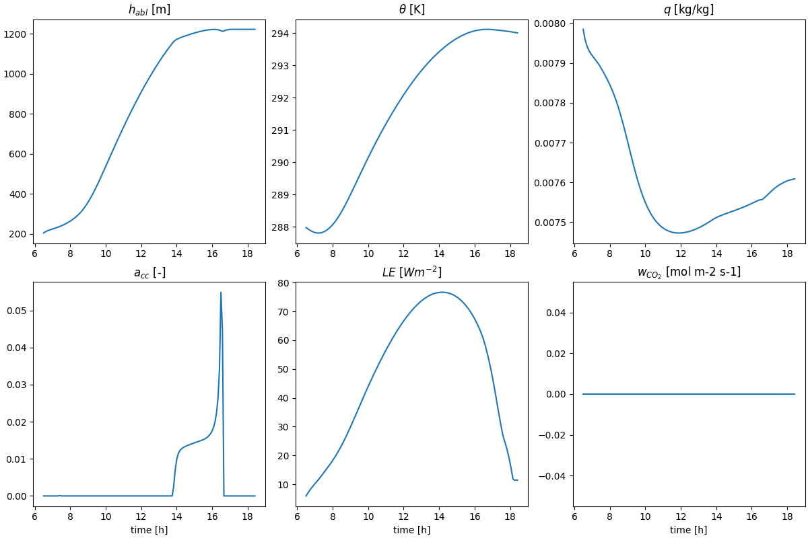

ABC Model
=========

A simple model coupling biosphere and atmosphere made fully differentiable using JAX built up on the `CLASS model <https://github.com/classmodel/modelpy>`_.

Installation
------------

These instructions work on Linux and MacOS and assume that python with pip is installed already. Otherwise, install python and pip with the tool of your choice, such as `miniforge <https://conda-forge.org/download/>`_ or `uv <https://docs.astral.sh/uv/>`_, before you proceed. See below for full instructions to install on Windows.

Install with

.. code-block:: bash

   pip install git@github.com/EarthyScience/abc-model

or clone the repo and make an editable install inside your local repo using

.. code-block:: bash

   pip install -e .

If you want to use JAX on GPUs, please re-install JAX using the ``[gpu]`` tag in an environment with GPUs installed,
but this is not necessary to run the examples in this repository.

Quick example
-------------

To setup the coupler we will always use 3 components:

1. Radiation model (rad);
2. Land model (land);
3. Atmosphere model (atmos).

Each model is a class that is initialized with model-specific parameters and has states that are updated during the integration.

.. code-block:: python

   import abcmodel

   # radiation
   rad_model = abcmodel.rad.StandardRadiationModel()
   rad_state = rad_model.init_state()

   # land
   biosphere_model = abcmodel.land.biosphere.JarvisStewartModel()
   biosphere_state = biosphere_model.init_state()
   soil_model = abcmodel.land.soil.StandardSoilModel()
   soil_state = soil_model.init_state()
   surface_model = abcmodel.land.surface.StandardSurfaceModel()
   surface_state = surface_model.init_state()
   land_model = abcmodel.land.StandardLandModel(
       biosphere=biosphere_model,
       soil=soil_model,
       surface=surface_model,
   )
   land_state = land_model.init_state(
       biosphere_state=biosphere_state,
       soil_state=soil_state,
       surface_state=surface_state,
   )

   # atmos
   surface_layer_model = abcmodel.atmos.surface_layer.ObukhovModel()
   surface_layer_state = surface_layer_model.init_state()
   mixed_layer_model = abcmodel.atmos.mixed_layer.BulkModel()
   mixed_layer_state = mixed_layer_model.init_state()
   cloud_model = abcmodel.atmos.clouds.CumulusModel()
   cloud_state = cloud_model.init_state()
   atmos_model = abcmodel.atmos.DayOnlyAtmosphereModel(
       surface_layer=surface_layer_model,
       mixed_layer=mixed_layer_model,
       clouds=cloud_model,
   )
   atmos_state = atmos_model.init_state(
       surface=surface_layer_state, mixed=mixed_layer_state, clouds=cloud_state
   )

All set - let's integrate our model by defining the timestepping and the run time.

.. code-block:: python

   # time step [s]
   inner_dt = 15.0 # this is the "running" time step
   outter_dt = 60.0 * 30 # this is the "diagnostic" time step
   # total run time [s]
   runtime = 12 * 3600.0
   # start time of the day [h]
   tstart = 6.5

   # coupler and coupled state
   abcoupler = abcmodel.ABCoupler(rad=rad_model, land=land_model, atmos=atmos_model)
   state = abcoupler.init_state(rad_state, land_state, atmos_state)

   # run run run
   time, trajectory = abcmodel.integrate(
       state, abcoupler, inner_dt, outter_dt, runtime, tstart
   )

To plot the results, we just have to use the plotting function.

.. code-block:: python

    # plot output
    abcmodel.plotting.simple(time, trajectory)
    plt.show()

Which should give us something like the figure below.

Windows installation
--------------------

On Windows we need some more utilities for JAX to work properly, also installing python is not as straigforward. For JAX to run, you first need the Microsoft Visual C++ redistributable found `here <https://learn.microsoft.com/en-us/cpp/windows/latest-supported-vc-redist?view=msvc-170#visual-studio-2015-2017-2019-and-2022>`_, which will require a system restart to function. Note that you might want to install uv before the restart, as the PATH update might require a restart as well (see below).

Now clone the repo and cd into it. The following section shows how to set up a python environment with `uv <https://docs.astral.sh/uv/>`_, if you have python with pip running you can skip it.

UV environment
~~~~~~~~~~~~~~

First install uv via the terminal with

.. code-block:: bash

   powershell -ExecutionPolicy ByPass -c "irm https://astral.sh/uv/install.ps1 | iex"

You can check that uv is available and running by typing ``uv`` in your terminal, if you receive an error, you will have to add uv to your path manually or `restart your computer <https://github.com/astral-sh/uv/issues/10014>`_. Here, or when executing uv scripts to activate environments windows `execution policiy <https://learn.microsoft.com/en-us/powershell/module/microsoft.powershell.core/about/about_execution_policies?view=powershell-7.4#powershell-execution-policies>`_ might stop you, if that is the case you need to change or bypass it.

After uv is installed and running, create a virtual environment in the abc-model directory by running

.. code-block:: bash

   uv venv --python 3.13.0

this will also show you the command needed to activate the venv, which should look similar to

.. code-block:: bash

   .venv\Scripts\activate

Lastly, while in the abc-model directory, install the abc-model with uv:

.. code-block:: bash

   uv pip install -e .

See also
--------

For a more advanced model, see `ClimaLand.jl <https://github.com/CliMA/ClimaLand.jl>`_.

.. toctree::
    :hidden:

    ABC Model <source/api/abcmodel>
